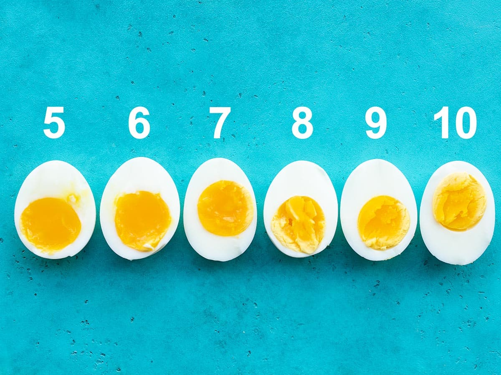

*This example shows how to embed images alongside the content file*

# How to Boil Eggs Fast
Half of the time spent when boiling eggs is just waiting for the water to boil, so I like to use a combination of boiling water and steam. To create the steam you only need one inch of water in the pot, which comes to a boil in just a few quick minutes instead of several minutes for a full pot of water. The steam from the boiling water is then trapped under the lid, it surrounds the egg, and cooks the egg just as quickly and evenly as a full pot of water. The quick steaming method allows you to cook your soft boiled egg in just six minutes, or about the amount of time that it takes to start making your coffee or toast a piece of bread.

# How Long for Soft Boiled Eggs?

